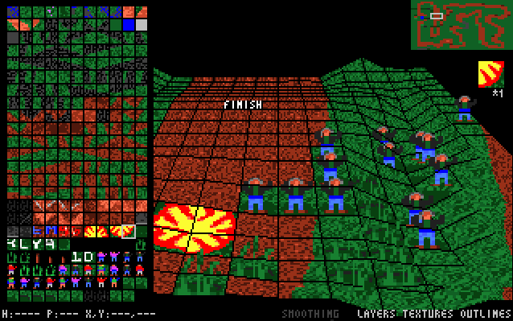
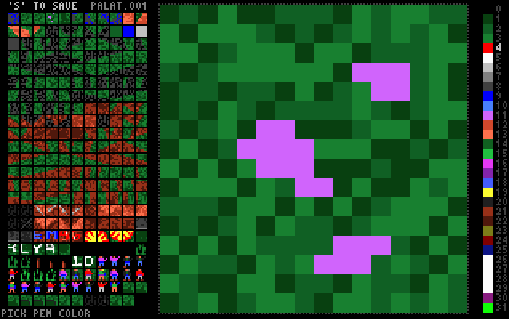

# RallySportED-DOS
Versions of [RallySportED](../../../rallysported)'s track, texture, and AI editors for DOS. These versions will run on 386/486-class hardware in DOS, and/or on modern systems under DOSBox and the like.

You'll find pre-compiled binaries of this code on [Tarpeeksi Hyvae Soft's website](http://www.tarpeeksihyvaesoft.com/soft/), along with more thorough instructions on usage.

## Modules
The DOS version of RallySportED is split into four different modules (or executables, if you like): `RGEO`, `RLOAD`, `RTEX`, and `RAI`. Each module serves a particular purpose in creating assets for Rally-Sport. You can learn more about them in brief, below.

**RGEO** &mdash; Track editor. Edit a track's heightmap and/or tilemap.

RGEO features pseudo-3d rendering of Rally-Sport's heightmap (MAASTO files) and tilemap (VARIMAA files) track data, and will run on a 486-66 MHz CPU (Pentium 60+ recommended). The terrain can be raised, lowered, and painted with the game's textures to create entirely new tracks, or to just modify the existing ones. Written in C++, RGEO is the only module whose source code is currently not available in this repo.

**[RTEX](modules/rtex/)** &mdash; Texture editor. Edit the game's track surface textures.

Written in assembly and able to run on a 386-16 MHz CPU, RTEX lets you modify the textures with which Rally-Sport's track surfaces are painted. These are the textures stored in the game's PALAT files, in other words.

**[RAI](modules/rai/)** &mdash; AI editor. Change how the game's CPU opponent drives a particular track.

A pretty cool module, it records a lap you drive around a track in Rally-Sport, and saves that as the track's AI opponent. In other words, the AI will from then on drive the track more or less as you did. You might use this tool primarily to create custom AI for your new tracks; but another cool use for it is to create AI opponents for existing tracks that give you just the right level of challenge (they'll drive like you do, so the races will be even, and you can make them a bit faster or slower by changing the game's difficulty level).

**[RLOAD](modules/rload/)** &mdash; Track loader. Allows you to play your custom tracks in Rally-Sport.

Once you've made a new track &ndash; or modified an existing one &ndash; load it into Rally-Sport using this module, and you're good to start playing it. A loader is required simply because the game hard-codes its assets, so its binary files need a bit of coaxing to accept custom content. The loader first makes copies of the relevant files, then modifies only the copies, so don't worry about original executable data being altered.

## Building
You'll find a readme file in each module's folder, containing instructions on how to build that module. Pretty much the only thing you need for any of them is the fasm assembler (it's free) and a simple command-line string.
