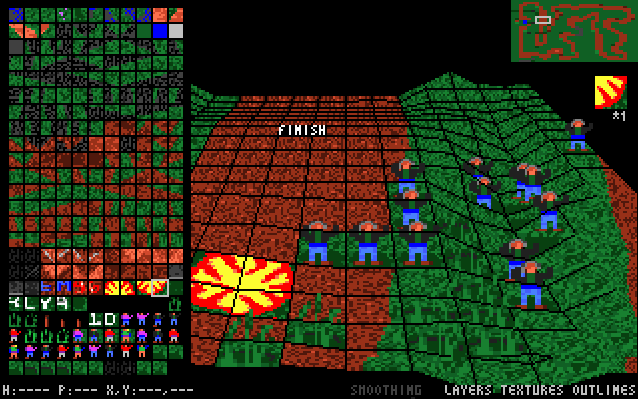

# RallySportED-DOS
Versions of [RallySportED's](../../../rallysported) track, texture, and AI editors for DOS. These will run on 386/486-class hardware in DOS, and/or on modern systems under DOSBox. Featured is, among other things, a pseudo-3d renderer that's usable on a 66-Mhz 486.

You can find pre-compiled binaries, along with more thorough documentation, on [Tarpeeksi Hyvae Soft's website](http://www.tarpeeksihyvaesoft.com/soft/).



### Modules
The DOS toolset consists of four modules: ```RGEO```, ```RLOAD```, ```RTEX```, and ```RAI```. To learn more about them, you can leaf through the documentation that comes with the tools' binary distribution (see link, above). Put briefly, ```RGEO``` is a 3d track editor, written in C++ and is not included in this repo. ```RLOAD``` is a module for loading RallySportED-made tracks into the game. ```RTEX``` is a texture editor with which you can edit tracks' surface textures. ```RAI``` lets you edit the tracks' AI.

### Building
You'll find a readme file in each module's folder with instructions on building that module. Generally speaking, you'll need the free fasm assembler, and not much else.
